# act3_2_nginx_seguridad

## Proceso de instalación

### Definición de red en VirtualBox y Ubuntu

1. Definición de red en VirtualBox y Ubuntu:
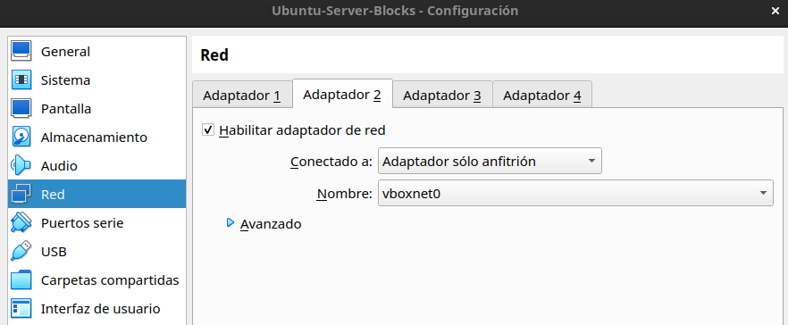
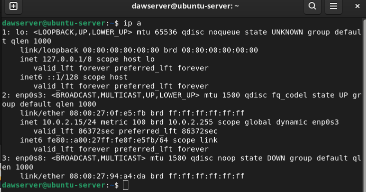
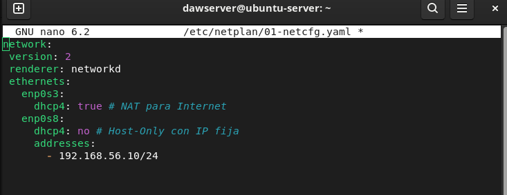
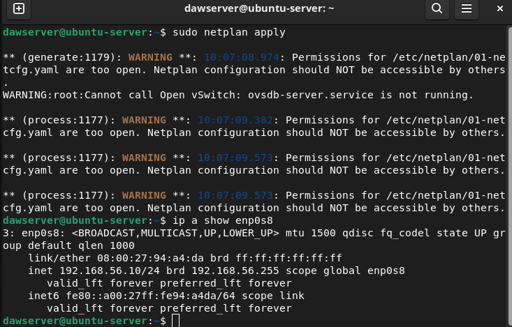
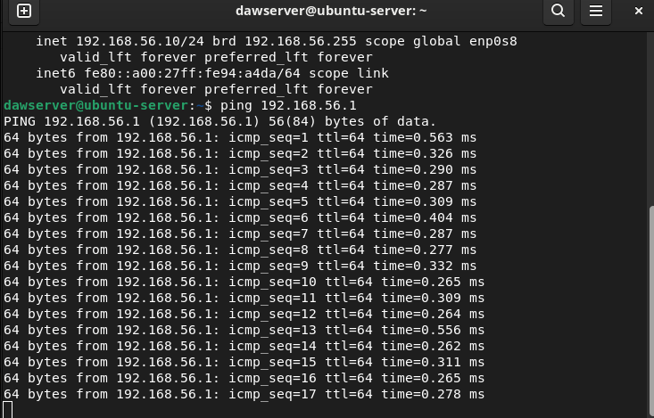
2. Comprobación o instalación de dependencias (Nginx, htpasswd, mkcert):
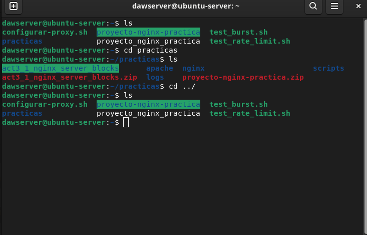
3. Creación de directorios y permisos:
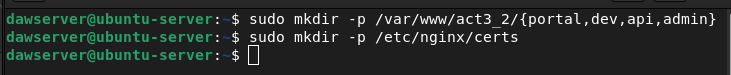
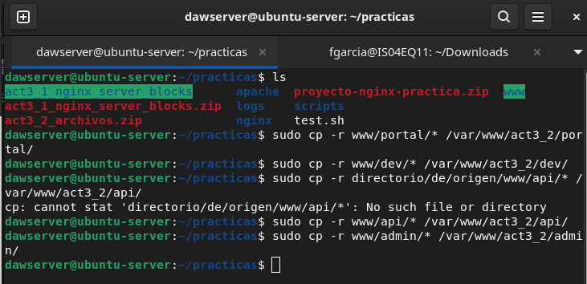
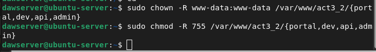
4. Generación de archivos de contraseñas:
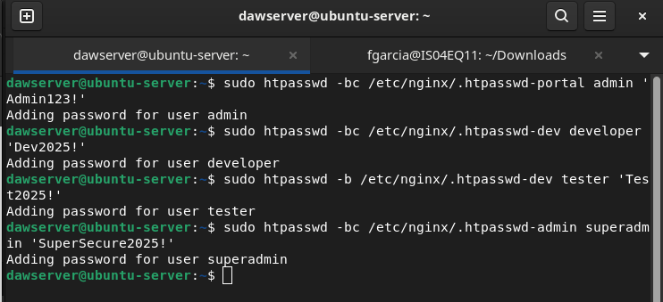
5. Generación de certificados SSL
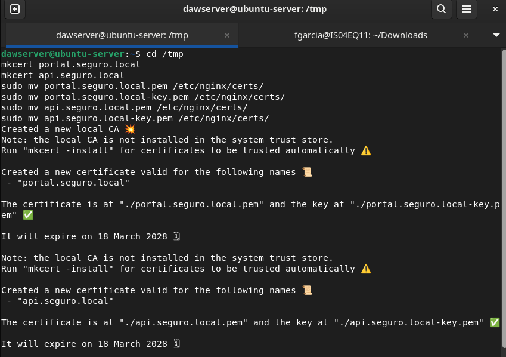
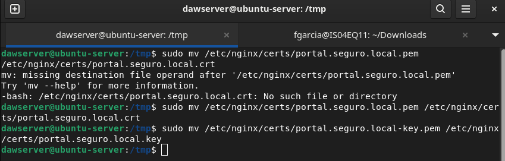
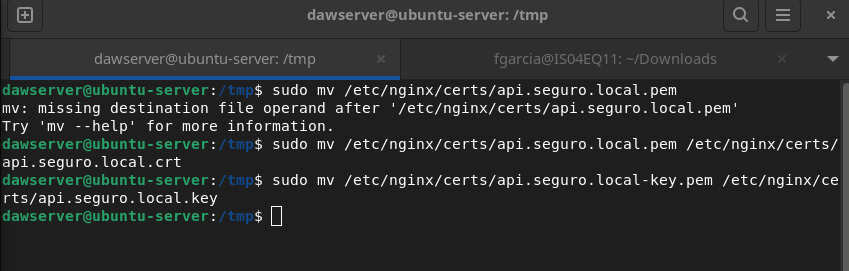
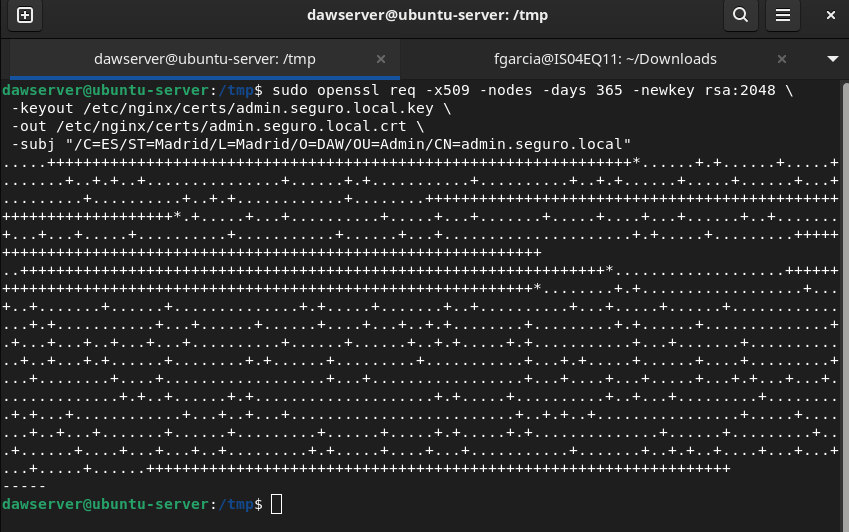
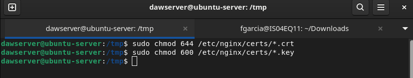
6. Configuración de Nginx (copiar archivos, definir zonas de rate limiting)

7. Habilitación de sitios y recarga de Nginx

8. Configuración del archivo hosts

## Pruebas manuales

Algunas de las capturas solicitadas en este apartado, por ejemplo la de configuración de red, ya están en el apartado anterior, por lo que no veo necesario volver a repetirlas aquí.

## Pruebas automáticas

## Problemas encontrados y soluciones

La práctica aún está sin terminar, debido a que me quedó la máquina virtual en clase. Lo terminaré el jueves o viernes y añadiré los apartados que faltan en este readme.
